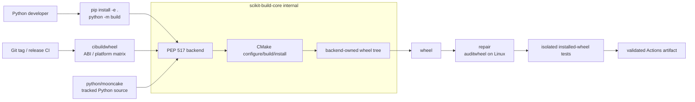
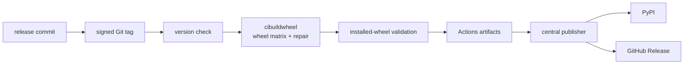

import PythonPackageRefactorExplorer from '../../components/PythonPackageRefactorExplorer.astro'

Mooncake 的 Python 包已经不再只是几层 pybind binding。它同时承载 Transfer Engine、Store、EP/PG、reshard、结构化对象存储、服务命令以及 vLLM 等框架的集成。代码能力在增长，但包的组织方式仍然更接近“把组件产物收集成一个 wheel”的阶段。

这篇文章讨论的不是一次目录美化，而是让**源码、构建、开发、测试与发布重新指向同一个事实来源**。

<PythonPackageRefactorExplorer />

理想状态下，开发者编辑的 Python、测试导入的 Python 和用户从 PyPI 安装的 Python 应该是同一份代码。Mooncake 当前还做不到这一点：构建脚本需要从多处复制文件，源码目录同时承担 staging 职责，而 reshard 通过 namespace path extension 与主包拼接。

目标方案把所有受版本控制的 Python 代码统一放到 `python/mooncake`，把原生扩展改成私有实现模块，再通过稳定的公开 facade 暴露 API。`scikit-build-core` 是唯一的 PEP 517 build backend：Python 开发者只使用 `pip install -e .`、`uv sync` 和 `python -m build`，CMake configure/build/install 以及临时安装树都收进 backend 内部。发布 CI 再由 `cibuildwheel` 对同一个 backend 执行 Python ABI、平台与架构矩阵，完成可分发 wheel 的修复和安装后验证。

统一源码根不等于把组件揉成一个模块。`engine`、`store`、`ep`、`pg`、`reshard` 与 `integrations` 仍然拥有各自的公开边界；交互图中的组件节点展示了它们如何共享一棵源码树，同时把 `_engine`、`_store`、`_ep` 和 `_pg_<torch-abi>` 留作内部实现。

## 我们真正要解决什么

### 1. 同一个 Python 包来自多棵源码树

今天的 Python 代码分散在几类目录里：

- `mooncake-wheel/mooncake` 保存大多数模块；
- `mooncake-integration` 保存 allocator、shared segment 和 async store；
- `mooncake-reshard/python/mooncake` 提供 `mooncake.reshard`；
- EP、PG 等组件分别拥有自己的 binding 和测试。

这种布局对单个 C++ 组件很自然：wrapper 就放在实现旁边。但对于一个最终以 `import mooncake` 交付的 Python 包，它缺少唯一的 source of truth。

一个 Python 文件是否会进入 wheel，取决于 `build_wheel.sh` 有没有复制它。一个测试到底导入已安装的文件还是源码文件，也可能取决于 `PYTHONPATH`、`conftest.py` 和上一次构建留下的内容。

### 2. 源码目录同时承担 staging 职责

当前构建会把 `.so`、可执行文件和其他组件的 `.py` 文件复制进 `mooncake-wheel/mooncake`，并针对不同 wheel variant 临时修改 `pyproject.toml`。构建结束后再尝试恢复。

只要中途失败，就可能留下一个既不是纯源码、也不是完整安装包的工作区。连续构建 CUDA、non-CUDA、EFA 等变体时，也需要格外小心前一个变体的文件有没有残留。

这类问题并不是多写几条清理命令就能解决。根本问题是：**源码树不应该是构建工作区。**

### 3. 模块边界没有跟上能力增长

当前包根目录平铺着 Store、EP、CLI、服务端、SSD 工具、vLLM adapter 和结构化对象存储。尤其 `structured_object_store.py` 已经同时承担数据模型、manifest、buffer、传输和多种 codec。

平铺结构会带来两个长期问题：

1. 新能力不知道应该放在哪里，最后继续堆到已有大文件；
2. import dependency 很容易反向渗透，例如核心包在导入时意外要求 Torch、vLLM 或某个硬件 runtime

   。

### 4. 依赖声明和真实能力不一致

核心 wheel 只声明了少量依赖，但部分模块还会使用 NumPy、PyTorch、Pillow、msgspec、ZeroMQ、FastAPI、httpx、Paramiko 和 vLLM。

把这些全部塞进默认依赖并不合理：安装 Transfer Engine 的用户不应该被迫安装 vLLM。完全不声明也不合理：运行到某个分支才遇到 `ModuleNotFoundError` 很难排查。

我们需要区分：

- 最小核心依赖；
- 某一能力的 optional extra；
- 开发与测试依赖；
- CUDA、ROCm、CANN、MUSA 等环境选择。

### 5. 发布流程有 wheel，却缺少一个统一的“发布事实”

Mooncake 已经有正式 wheel 发布：稳定 tag 会触发构建，wheel 会上传到 PyPI，并附加到 GitHub Release。问题在于默认 CUDA、CUDA 13、non-CUDA、EFA、ROCm、NPU、MUSA 分散在多份 workflow 中，每份都可能重复处理 tag、artifact 和发布尾部。

这里要区分三件事：

- Actions artifact 是 CI 中间产物；
- PyPI wheel 是 Python 用户真正安装的发布物；
- GitHub Release 是围绕一个 tag 汇总的版本记录和下载入口。

它们应该由同一份版本事实串起来，而不是碰巧使用相似的字符串。

## 设计原则

这次调整遵循七条原则：

1. **一个 Python 源码根。** 受版本控制的 `mooncake` 包代码全部位于 `python/mooncake`。
2. **一个标准 Python 构建契约。** 本地开发直接进入 `scikit-build-core`；发布由 `cibuildwheel` 对同一个 backend 执行矩阵，不把 CMake 命令暴露为 Python 工作流的一部分。
3. **源码与产物隔离。** `.so`、可执行文件和组装后的 metadata 只进入 backend 管理的构建目录。
4. **公开 API 与实现文件名解耦。** 用户导入稳定的 Python facade，原生模块使用私有名称。
5. **可选能力按需安装。** 核心 import 不加载 vLLM、Torch 或无关硬件 runtime。
6. **测试最终交付物。** 发布门禁安装并运行 wheel，而不是只测试源码树。
7. **发布由 immutable tag 驱动。** tag、`pyproject.toml` 和 wheel metadata 必须一致。

## 目标目录长什么样

目录并不是越深越好。目标是让一个文件的职责和依赖方向能从路径上被理解：

```text
pyproject.toml

python/
  pyrightconfig.json

  mooncake/
    __init__.py

    engine/
      __init__.py
      shared_segment.py

    store/
      __init__.py
      async_client.py
      buffer_pool.py
      config.py
      structured/
        api.py
        models.py
        manifest.py
        transport.py
        buffer.py
        codecs/

    ep/
      __init__.py
      buffer.py
      elastic_buffer.py

    pg/
      __init__.py

    reshard/
      contracts/
      weight/

    allocators/
    integrations/
      dataproto/
      vllm/
    services/
    ssd/
    cli/

  tests/
    unit/
    integration/
    e2e/
    hardware/
    packaging/
    typecheck/
```

原有 C++ 组件目录继续拥有原生实现。我们不是把整个仓库搬进 `python/`，而是把“最终属于 Python import package 的源码”收敛到一个地方。

### 为什么 structured object store 放在 Store 下

结构化对象存储提供的是数据模型、序列化和对象传输抽象，并不天然只属于 RL。真正与 DataProto 或训练框架绑定的逻辑，放在 `mooncake.integrations.dataproto` 更清楚。

这样核心 Store 可以被其他场景复用，framework adapter 也不会反向进入核心模块。

### 为什么 reshard 仍然保留独立边界

统一源码根不等于抹平子系统边界。`mooncake.reshard` 进入同一棵 package tree 后，仍然保留自己的 contracts、weight API、typecheck 和测试命令。

我们移除的是 namespace path 拼接，不是 reshard 的模块自治。

## 原生扩展变成实现细节

当前 `engine.so`、`store.so` 直接占据公开模块名。目标结构将它们改成：

```text
mooncake._engine
mooncake._store
mooncake._ep
mooncake._pg_<torch-abi>
```

公开入口由普通 Python package 提供：

```python
# mooncake/engine/__init__.py
from mooncake._engine import TransferEngine, TransferOpcode

__all__ = ['TransferEngine', 'TransferOpcode']
```

用户和上游框架仍然使用：

```python
from mooncake.engine import TransferEngine
from mooncake.store import MooncakeDistributedStore, ReplicateConfig
from mooncake.pg import set_transfer_engine
```

这不是临时兼容，而是永久公开 facade。SGLang 和 vLLM 已经依赖这些路径，所以目录重构本身不应该迫使它们修改代码。

facade 的意义不只是“转发一次 import”。它给我们一个稳定的位置放置：

- 显式 `__all__`；
- 类型提示和文档；
- capability 检查；
- 对不同 Torch ABI extension 的选择；
- 将来替换或拆分原生实现的空间。

## 兼容层应该窄，而不是没有边界

公开 facade 可以解决绝大多数 SGLang/vLLM 兼容问题。但如果一个已经被外部使用的模块确实需要改名，例如：

```text
mooncake.structured_object_store
    ↓
mooncake.store.structured
```

就需要给上游一个发布周期：

```python
# mooncake/structured_object_store.py
import warnings

from mooncake.store.structured import StructuredObjectStore

warnings.warn(
    'mooncake.structured_object_store is deprecated; '
    'use mooncake.store.structured',
    DeprecationWarning,
    stacklevel=2,
)

__all__ = ['StructuredObjectStore']
```

这类 transition module 必须满足几个条件：

- 只有一份实现，旧路径只做显式 re-export；
- 不允许 `import *`、fallback 或 namespace extension；
- 旧对象与新对象必须保持 identity；
- 每个旧路径都对应一个真实的外部 consumer；
- 记录上游 issue/PR 和删除版本；
- 在宣布的兼容边界，例如 `0.4.0`，完成删除。

换句话说，我们兼容的是外部 API，不是旧仓库目录。

## wheel 怎样构建：只暴露一个 Python 入口

新的构建链不再定义一个需要开发者理解或操作的 `wheel-stage`。唯一构建契约是标准的 PEP 517 请求：[scikit-build-core](https://scikit-build-core.readthedocs.io/en/latest/) 负责收集 Python package、调用 CMake 并管理临时 wheel tree；[cibuildwheel](https://cibuildwheel.pypa.io/en/latest/) 则在发布 CI 中重复调用这个 backend，生产不同 Python ABI、平台和架构的可分发 wheel。



`pyproject.toml` 声明唯一 build backend，并让它直接收集 `python/mooncake`：

```toml
[build-system]
requires = ["scikit-build-core", "pybind11"]
build-backend = "scikit_build_core.build"

[tool.scikit-build]
wheel.packages = ["python/mooncake"]
build-dir = "build/python/{wheel_tag}"
```

原生侧只提供 CMake install contract。例如私有扩展安装到最终 package namespace：

```cmake
pybind11_add_module(_engine ...)
install(TARGETS _engine LIBRARY DESTINATION mooncake)
```

这是 native maintainer 与 build backend 之间的契约，不是 Python 开发者需要执行的步骤。无论是 editable install 还是 release wheel，scikit-build-core 都会自动 configure、build、install，再把原生产物与 `python/mooncake` 汇合。中间安装树由 backend 创建和清理，不进入公开工作流。

CUDA 13、non-CUDA、EFA 等差异通过 CI matrix 和 backend config 传入；不能再通过复制源码、临时改 `pyproject.toml` 或维护 variant-specific staging 脚本表达。

### cibuildwheel 位于哪一层

`scikit-build-core` 与 `cibuildwheel` 不是两套构建系统。前者实现一个 wheel 如何从源码产生，后者负责发布时为哪些 Python ABI、平台和架构重复调用这个 backend，并在 Linux 上执行 `auditwheel` repair。Python 开发者不需要运行或配置 `cibuildwheel`；它是 release CI 的执行层。

两者通过 `pyproject.toml` 和 PEP 517 config settings 对接。例如 packaging smoke test 可以直接写进仓库配置：

```toml
[tool.cibuildwheel]
test-sources = ["python/tests/packaging"]
test-command = "python python/tests/packaging/smoke.py"

[tool.cibuildwheel.config-settings]
"cmake.build-type" = "Release"
```

`cibuildwheel` 会从源码树之外的临时目录安装并测试刚刚生成的 wheel，因此测试不会意外导入 `python/mooncake`。GitHub Actions 的外层 matrix 只选择产品变体和对应 toolchain，例如 CUDA、non-CUDA 或 EFA；`cibuildwheel` 的内层 matrix 负责 Python tag、platform tag、架构、repair 与 installed-wheel test。

标准 manylinux 变体应直接使用 `cibuildwheel`。ROCm、NPU、MUSA 等依赖特殊 runner 或 toolchain 的变体可以保留专用 builder；能够满足 manylinux 容器契约时同样调用 `cibuildwheel`，否则也必须实现相同的 backend、repair、测试和 artifact 输出契约，不能退回修改源码树的 staging 流程。

### wheel 门禁测试什么

源码单测通过只是第一层。真正发布前还需要检查：

- `twine check`；
- distribution name、version、Python ABI 和 platform tag；
- wheel 文件清单；
- 干净虚拟环境中的 `pip install --no-deps`；
- `mooncake.engine/store/ep/pg` 公开导入；
- CLI 的 `--version` 或最小启动路径；
- private native extension 加载；
- ELF dependency 和 RPATH；
- 临时兼容路径与新路径的对象 identity。

这组测试不允许把仓库源码加入 `PYTHONPATH`。否则我们测试的仍然可能不是 wheel。

## 日常开发怎样工作

### 纯 Python 修改

manifest、codec、reshard contract 和 adapter 等工作只使用标准 Python 命令：

```bash
python3 -m venv .venv
source .venv/bin/activate

pip install -e '.[dev,structured]'
pytest python/tests/unit
```

scikit-build-core 的默认 redirect editable mode 会直接映射 `python/mooncake`，所以 `.py` 修改立即生效。首次 editable install 仍可能编译原生扩展，但 Python 开发者不需要知道 CMake build directory、install prefix 或产物复制路径。

这同时要求 `mooncake.__init__` 足够轻量：不能在包导入时就尝试加载所有 native extension、Torch 或 vLLM。纯 Python 单测应能在不触发无关原生模块的情况下运行。

### 原生联调

需要 binding 时仍然使用同一个 editable install，而不是切换到一套手工 CMake 工作流：

```bash
pip install -e '.[dev]'
pytest python/tests/integration
```

修改 C++ extension 后重新执行 editable install，由 scikit-build-core 完成增量 configure/build/install；修改纯 Python 则无需重装。native maintainer 仍然可以直接使用 CMake 做底层调试，但那是原生组件内部工作流，不是 Python package 的开发入口。

“不感知 C++ 构建细节”不等于源码安装时不需要编译器。如果纯 Python 开发环境连 C++ toolchain 都不应安装，就需要让它消费 CI 预构建的 native wheel；scikit-build-core 解决的是统一构建边界，而不是凭空消除原生编译。

## 依赖怎样分层

最终列表需要逐模块 audit，但结构应该明确：

| 层级             | 示例                                 | 安装方式                               |
| ---------------- | ------------------------------------ | -------------------------------------- |
| core             | aiohttp、requests、msgpack           | `pip install mooncake-transfer-engine` |
| structured       | NumPy、Pillow                        | `pip install '.[structured]'`          |
| vLLM integration | msgspec、pyzmq、FastAPI、httpx、vLLM | `pip install '.[vllm]'`                |
| admin            | Paramiko                             | `pip install '.[admin]'`               |
| dev              | pytest、ruff、pyright、build、twine  | `pip install '.[dev]'`                 |
| hardware         | Torch CUDA/ROCm/NPU/MUSA 组合        | 显式 requirements/constraints          |

Torch 与 accelerator runtime 不适合作为 core wheel 的无条件依赖。它们由环境专用 requirements、CI image、CMake 检查和依赖脚本共同约束。

关键标准是：导入一个核心 API 时，不应该因为没有安装一个无关 integration 而失败。

## tag、wheel 和 GitHub Release 怎样闭环

`pyproject.toml` 是 package version 的 source of truth；Git tag 选择不可变的 release commit。二者必须一致：

```text
pyproject version       Git tag
0.3.13                  v0.3.13
0.3.13.post1            v0.3.13.post1
0.3.14rc1               v0.3.14rc1
```

workflow 使用 PEP 440 parser 判断 stable、prerelease 和 development version，而不是通过 tag 中有没有 `-` 来猜。



正常发布动作很简单：

```bash
git tag -s v0.3.13 <release-commit> -m 'Mooncake v0.3.13'
git push origin v0.3.13
```

真正的复杂性应该被 reusable builders 吸收，而不是复制在九个入口 workflow 中。标准 builder 以 `pypa/cibuildwheel` 为执行入口；它最终仍通过 PEP 517 调用项目声明的 `scikit-build-core`，而不是维护另一套 CMake 命令。

```text
.github/workflows/
  python-wheel-ci.yaml
  python-release.yaml

  _build-python-wheel.yaml
  _build-python-efa-wheel.yaml
  _build-python-rocm-wheel.yaml
  _build-python-npu-wheel.yaml
  _build-python-musa-wheel.yaml
  _publish-python-wheel.yaml
```

其中：

- CUDA、CUDA 13、non-CUDA 使用标准 matrix，并由 `cibuildwheel` 负责 Python ABI、架构、manylinux repair 和 installed-wheel test；
- EFA 保留自己的环境 matrix；
- ROCm、NPU、MUSA 继续拥有独立 builder，因为 runner 和 toolchain 确实不同；
- 特殊 builder 在环境允许时复用 `cibuildwheel`，否则仍遵守同一 PEP 517 输入和 artifact 输出契约；
- builder 只构建、验证和上传 Actions artifact，不持有 PyPI 凭据或 OIDC 发布权限；
- publisher 收集 wheel 与单独构建的 sdist，检查文件名、version、tag 和 digest 后，才通过 [PyPI Trusted Publishing](https://docs.pypi.org/trusted-publishers/) 发布并更新 GitHub Release。

`cibuildwheel` 因此是**发布 wheel 的标准构建与验证方案**，不是 publisher。上传动作集中在唯一的 publication job，例如 `pypa/gh-action-pypi-publish`；这样矩阵中的任意 builder 都不能绕过汇总校验直接发布一个不完整版本。

### 统一入口不等于所有硬件互相阻塞

如果把每一个特殊 accelerator runner 都变成默认 wheel 的硬前置条件，一个临时不可用的 NPU runner 就可能阻塞 CUDA 用户拿到修复版本。

更合理的是：

- 默认 CUDA、CUDA 13 和 non-CUDA 形成 core release gate；
- EFA、ROCm、NPU、MUSA 使用同一 tag 和版本；
- 特殊变体可以针对已有 tag 独立 retry/backfill；
- backfill 只能引用已有 tag，不能静默创建或移动 tag。

PyPI 文件不可覆盖。重试时需要验证已存在文件的 digest，而不是简单使用 `skip-existing` 掩盖任何冲突。

## 怎样分阶段落地

这是一个大改动，但不应该把仓库长期留在“两套包结构都没完成”的状态。

### 第一阶段：冻结公开契约

- 建立外部 import allowlist；
- 确认 SGLang、vLLM 和其他 consumer；
- 增加 source import 与 installed-wheel contract test；
- 明确永久 facade 和少量 transition module。

### 第二阶段：建立唯一源码树

- 创建 `python/` project；
- 移动 Python 模块与测试；
- 把 native extension 改为私有名；
- 更新所有 Mooncake 内部 import；
- 删除旧 Python 源码位置和 `pkgutil.extend_path`。

源码移动和匹配的构建修改需要一起生效，避免两个目录同时成为权威实现。

### 第三阶段：建立 scikit-build-core 构建边界

- 将 `scikit_build_core.build` 设为唯一 PEP 517 backend；
- 用 CMake install rules 把私有原生扩展交给 backend；
- 让 wheel 与 editable install 共用同一构建契约；
- 将 variant 差异改为 CI matrix 和 backend config；
- 在隔离环境验证每个 wheel；
- 删除 staging 脚本、复制、恢复和源码内清理逻辑。

### 第四阶段：收敛 CI 与发布

- builder 统一为 PEP 517 输入和 wheel artifact 输出契约；
- 标准变体通过 `cibuildwheel` 构建、repair 并执行 installed-wheel test；
- 产品变体使用外层 matrix，Python ABI、平台和架构使用 `cibuildwheel` 内层 matrix；
- 加入 tag/version 校验；
- 通过单独的 Trusted Publishing job 集中 PyPI 与 GitHub Release publication；
- 保留特殊平台从已有 tag backfill 的能力。

### 第五阶段：结束兼容窗口

- 合并并发布上游 import 更新；
- 用上游稳定版跑 Mooncake integration CI；
- 在约定版本删除 transition module；
- 同时删除对应兼容测试并写入 release notes。

## 收益与代价

| 维度                   | 当前                   | 目标                                |
| ---------------------- | ---------------------- | ----------------------------------- |
| Python source of truth | 多棵源码树             | `python/mooncake` 一处              |
| 源码与产物             | 同一目录混合           | source 与 backend 构建树分离        |
| 本地开发               | 依赖复制和路径补丁     | 标准 PEP 517 editable install       |
| 原生 API               | `.so` 直接占公开模块名 | private extension + public facade   |
| 依赖                   | 隐式或过度安装         | core/extras/hardware 分层           |
| wheel 验证             | 容易被源码路径影响     | 隔离安装验证                        |
| 版本发布               | 多入口重复策略         | tag + cibuildwheel + 集中 publisher |
| 兼容                   | 目录偶然稳定           | 明确 public contract 与删除窗口     |

最大的收益不是目录变得整齐，而是减少“环境状态”对结果的影响：

- 开发者知道应该编辑哪一份文件；
- native maintainer 只维护 CMake install contract；
- scikit-build-core 不会修改源码；
- CI 测试用户真正安装的文件；
- cibuildwheel 对发布 wheel 的矩阵、repair 和安装测试有统一实现；
- release publisher 对版本、artifact 和发布权限有唯一判断；
- 上游项目获得可预测的兼容窗口。

代价同样真实：

- 一次性 diff 很大；
- native module 重命名需要同时验证 pybind、Torch ABI、RPATH 和 auditwheel；
- optional dependency 边界需要测试，而不是只靠约定；
- release orchestration 集中后，必须保留按平台隔离重试能力；
- transition module 如果没有删除 milestone，很容易变成永久债务。

## 最终判断

Mooncake 当前结构的优势是组件局部性强，新增一个 C++ binding 很直接。但随着 Python API、框架集成和硬件 wheel 数量增加，构建脚本正在承担一个包管理系统才应该承担的职责。

统一 `python/` 目录并不是为了追求某种流行仓库外观。它要建立六个稳定边界：

```text
python/mooncake                  = 唯一 Python 源码
pyproject + scikit-build-core    = 唯一 Python 构建契约
CMake install rules              = backend 内部原生产物契约
cibuildwheel + CI variant matrix = 发布 wheel 构建与验证门禁
Git tag + pyproject              = 唯一发布版本事实
Trusted Publishing job           = 唯一 publication authority
```

只要这六个边界成立，Python 开发者就只需要理解 package、依赖和公开 API；CMake target、install prefix 与临时 wheel tree 都停留在 build backend 内部。发布 CI 只在更高一层选择 variant 和 wheel matrix，publisher 只接收验证通过的不可变 artifact。目录、测试、依赖和 release YAML 的简化会成为自然结果；如果只移动文件而保留原来的 copy-and-restore 构建方式，复杂度只会换一个位置继续存在。

这份方案仍在讨论中。相关背景可以参考 Mooncake 的 [RFC #3425](https://github.com/kvcache-ai/Mooncake/issues/3425)。
